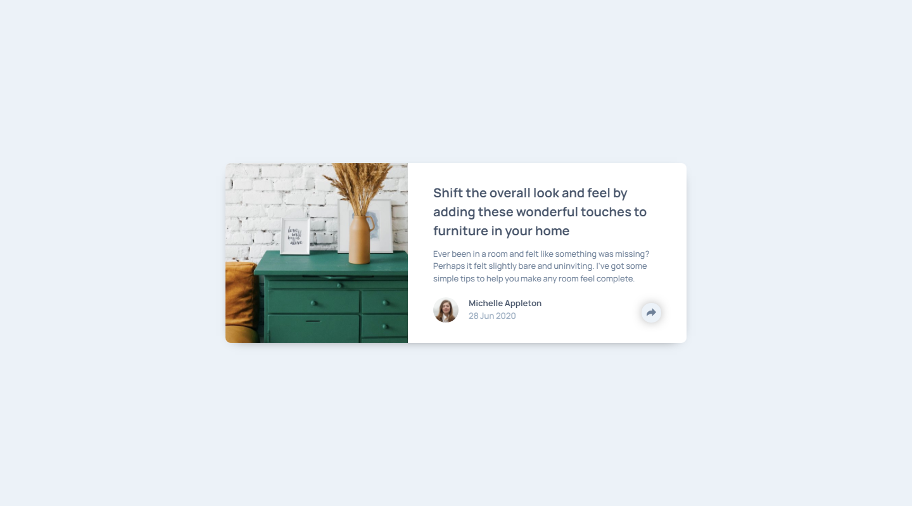

# Frontend Mentor - Article preview component solution

This is a solution to the [Article preview component challenge on Frontend Mentor](https://www.frontendmentor.io/challenges/article-preview-component-dYBN_pYFT). Frontend Mentor challenges help you improve your coding skills by building realistic projects. 

## Table of contents

- [Overview](#overview)
  - [The challenge](#the-challenge)
  - [Screenshot](#screenshot)
  - [Links](#links)
- [My process](#my-process)
  - [Built with](#built-with)
  - [What I learned](#what-i-learned)
  - [Continued development](#continued-development)
  - [Useful resources](#useful-resources)
- [Author](#author)

## Overview

### The challenge

Users should be able to:

- View the optimal layout for the component depending on their device's screen size
- See the social media share links when they click the share icon

### Screenshot



### Links

- HTML solution: [HTML](https://github.com/JustANipple/article-preview-component/blob/master/index.html)
- CSS solution: [CSS](https://github.com/JustANipple/article-preview-component/blob/master/style.css)
- JS solution: [JS](https://github.com/JustANipple/article-preview-component/blob/master/script.js)
- Live Site URL: [LIVE](https://justanipple.github.io/article-preview-component/)

## My process

### Built with

- Semantic HTML5 markup
- CSS custom properties
- Flexbox
- Mobile-first workflow
- Josh's Custom CSS Reset
- JavaScript

### What I learned

I have never placed a block on top of another when a user clicks a button, so it has been quite a challenge trying to organize all the containers and elements to make it as much responsive as possible
At first i thought of making the two divs (avatar and social) flowing vertically and then hiding one at a time when user clicked on the share button, but that made the whole text above move and resize to fit the container

What i've learnt with that is that i should've used the avatar block as relative container for my absolute social container and that solved my resizing problem

Making a simple triangle to create a bubble chat for the desktop view was a challenge too, but it looks like you need to work just with borders to make shapes

Triangle shape:
```css
.social:before {
  content: '';
  position: absolute;
  top: 100%;
  left: 0;
  right: 0;
  width: 0;
  height: 0;
  margin: 0 auto;
  border: .75rem solid transparent;
  border-bottom: none;
  border-top-color: var(--title-clr);
}
```

Social box:
```css
.social {
  display: flex;
  opacity: 0;
  visibility: hidden;
  position: absolute;
  left: 0;
  right: 0;
  height: 100%;
  background-color: var(--title-clr);
  align-items: center;
  gap: 1rem;
  padding-inline: 2rem;
  border-bottom-left-radius: 0.5rem;
  border-bottom-right-radius: 0.5rem;
  transition: visibility 0.3s ease, opacity 0.3s ease-in-out;
}
```

### Continued development

Hiding the overflow out of the main container made hard to use my positioned absolute social box outside of the borders, so i removed the overflow hidden and applied borders to every block where needed.
There might be a better solution to achieve this, so i'll go deep into this

### Useful resources

- [Microsoft Powertoys](https://learn.microsoft.com/it-it/windows/powertoys/) - Getting the challenge as close as the design is easier with this software that lets you pick the colors from an image and gives you sizes and spaces of objects
- [Filter generator](https://codepen.io/jumarjuaton/full/mdJYWYq) - This helped to change the SVG colors from white to any color you choose

## Author

- Frontend Mentor - [@JustANipple](https://www.frontendmentor.io/profile/JustANipple)
